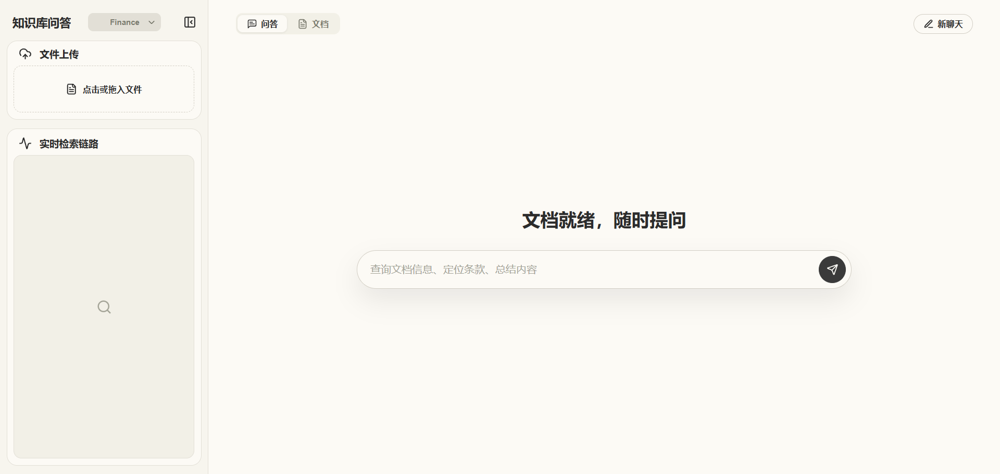

# FinRAG

[](#runtime-stack)
[](#runtime-stack)
[](#runtime-stack)
[](#runtime-stack)
[](#runtime-stack)
[](#runtime-stack)
[](#runtime-stack)
[](#runtime-stack)
[](#testing)
[](#testing)

FinRAG 是一个面向金融制度、合规流程、产品材料和投研摘要的企业级知识库 RAG 服务。系统围绕“可管理的资料库、可审计的检索链路、可追溯的生成答案”设计，覆盖文档生命周期管理、结构化解析、层级节点建模、Milvus 原生检索、LlamaIndex 路由编排、证据窗口扩展、结构化来源引用和 SSE 可观测问答接口。

> 项目定位：资料库问答与资料检索，不提供实时行情分析、投资推荐或交易决策。

## Workbench Preview



## Highlights

- **可审计文档生命周期**：`DocumentLifecycleService` 负责安全文件名、`content_hash` 去重、`.pending` 暂存、源文件提升、删除和重建索引；文档注册表对外暴露 `document_id`、`status`、`chunk_count`、`upload_time` 和错误信息。
- **原生 Milvus 检索**：`MilvusNativeHybridRetriever` 优先使用 Milvus `HYBRID` 查询模式，dense embedding 来自 DashScope `text-embedding-v4`，sparse embedding 由 PostgreSQL BM25 状态和中文分词生成，并通过 `RRFRanker(k=RAG_RRF_K)` 融合候选；当 collection 没有 sparse schema 时自动降级为 dense-only 检索。
- **层级证据窗口**：`HierarchicalNodeParser.from_defaults(chunk_sizes=[1200, 600, 300])` 构建 root / parent / leaf 节点；Milvus 召回 leaf vectors 后，`AutoMergingRetriever(simple_ratio_thresh=...)` 从 PostgreSQL docstore 回源父级节点，结合相邻节点和句子边界预算控制生成上下文。
- **路由化问答编排**：`llamaindex_router` 将问题路由到知识库问答或普通 LLM；知识库内部按 HyDE、step-back、auto-merge 查询工具处理不同问题形态。
- **可观测生成接口**：`/knowledge-bases/{knowledge_base_id}/ask` 以 SSE 输出 `analysis`、`route`、`source`、`token`、`done`、`error` 事件；`return_trace=true` 时在最终 `done.response.trace.pipeline_steps` 返回问答完成后的完整检索链路快照、Milvus 检索元信息、auto-merge 配置、来源节点和阶段耗时。
- **工程化运行底座**：PostgreSQL 承载 documents、docstore、BM25、manifest，Milvus 存储 leaf node dense vectors 和可选 sparse vectors，Docker Compose 提供本地依赖栈，pytest 与 Vitest 覆盖后端、检索、API 和 Web 工作台。

## Capabilities

| 模块         | 能力                                                                                                                                       |
| ------------ | ------------------------------------------------------------------------------------------------------------------------------------------ |
| 文档生命周期 | 支持 Markdown / TXT / PDF / DOCX / CSV / JSON / HTML/HTM / XLSX / PPTX 上传、同步或异步索引、列表、删除、重建索引，按 `content_hash` 识别重复内容                              |
| 文档建模     | 使用稳定 `document_id` / `chunk_id`、资料库 ID、页码、文件类型和父级/根级节点关系，保证检索、回源和引用一致                            |
| 索引存储     | leaf nodes 写入 Milvus dense collection 和可选 sparse schema，完整层级节点写入 PostgreSQL docstore，BM25 统计和 manifest 独立持久化                      |
| 检索增强     | 基于 Milvus native hybrid 或 dense-only 检索、资料库过滤、候选融合、Auto Merge、相邻节点扩展、分数过滤和可选 Jina rerank 构建证据集                           |
| 可信生成     | Grounded prompt 约束模型基于证据回答，资料不足时明确拒答；最终响应以结构化 `sources` 暴露文件名、页码、分数和片段                        |
| 可观测性     | SSE 事件流覆盖分析、路由、来源、token、完成与错误；最终 trace 记录 route、pipeline steps、retrieved/evidence nodes 和耗时        |
| 质量评估     | 提供 hit@k、MRR、keyword coverage 与 Ragas 指标，评估召回命中、排序质量、上下文质量和回答忠实性                                            |
| Web 工作台   | React/Vite 工作台提供 FinRAG 资料库状态、拖拽上传与确认索引、流式问答、Markdown 回答渲染、来源引用、最终检索链路快照、文档分页、删除和重建索引 |

## Architecture

```text
┌─────────────────────────────────────────────────────────────────────────────┐
│ React / Vite Workbench                                                     │
│ Knowledge bases · Upload · Documents · SSE chat · Sources · Trace snapshot │
└──────────────────────────────────────┬──────────────────────────────────────┘
                                       │ HTTP / SSE
┌──────────────────────────────────────▼──────────────────────────────────────┐
│ FastAPI                                                                     │
│ health · ready · knowledge-bases · documents · rebuilds · ask               │
└──────────────────────────────────────┬──────────────────────────────────────┘
                                       │
┌──────────────────────────────────────▼──────────────────────────────────────┐
│ RAGService / FinRAGSystem                                                   │
│ knowledge-base scope · runtime cache · lifecycle services · query pipeline  │
└───────────────┬──────────────────────────────────────────────┬──────────────┘
                │                                              │
                │ Indexing path                                │ Query path
                │                                              │
┌───────────────▼──────────────┐                ┌──────────────▼──────────────┐
│ DocumentLifecycleService     │                │ LlamaIndex Top Router       │
│ safe filename · hash · state │                │ knowledge_router / general  │
└───────────────┬──────────────┘                └──────────────┬──────────────┘
                │                                              │
┌───────────────▼──────────────┐                ┌──────────────▼──────────────┐
│ ParserRegistry               │                │ Knowledge Router            │
│ md/txt/pdf/docx/csv/json/... │                │ HyDE · step-back            │
│ structured table extraction  │                │ auto_merge                  │
└───────────────┬──────────────┘                └──────────────┬──────────────┘
                │                                              │
┌───────────────▼──────────────┐                ┌──────────────▼──────────────┐
│ DataPreparationModule        │                │ MilvusNativeHybridRetriever │
│ hierarchical nodes · metadata│                │ hybrid / dense-only         │
└───────────────┬──────────────┘                └──────────────┬──────────────┘
                │                                              │
                │                         ┌────────────────────▼──────────────┐
                │                         │ Auto Merge · Prev/Next · Filter   │
                │                         │ optional Jina rerank · token cap  │
                │                         └────────────────────┬──────────────┘
                │                                              │
                │                         ┌────────────────────▼──────────────┐
                │                         │ Grounded generation               │
                │                         │ answer · sources · final trace    │
                │                         └───────────────────────────────────┘
                │
┌───────────────▼──────────────────────┐        ┌─────────────────────────────┐
│ PostgreSQL                           │        │ Milvus                      │
│ document registry · docstore · BM25  │        │ dense leaf vectors          │
│ index manifest · knowledge bases     │        │ optional sparse vectors     │
└──────────────────────────────────────┘        └─────────────────────────────┘
```

运行时由 `RAGService` 统一承接 API 请求，并按知识库 ID 维护 `FinRAGSystem` 运行时。索引路径负责文件托管、解析、分块、元数据标准化和向量/节点持久化；问答路径负责路由判断、Milvus 召回、Auto Merge、相邻片段扩展、可选精排、上下文预算控制和基于证据的生成。

## RAG Pipeline

1. **Document Lifecycle**
   `/knowledge-bases/{knowledge_base_id}/documents/upload` 对上传文件执行扩展名校验、大小校验和安全文件名提取；`DocumentLifecycleService` 将文件写入受管理源文件目录，计算 `content_hash`，维护 `uploaded`、`parsing`、`indexed`、`failed`、`deleted` 状态，并支持同步索引、后台索引、删除和重建索引。
2. **Parsing & Metadata**
   解析层当前开放 Markdown、TXT、PDF、DOCX、CSV、JSON、HTML/HTM、XLSX、PPTX。Markdown/TXT 按文本读取；PDF 优先使用 PyMuPDF 按页提取文本，pypdf 作为文本提取备选；DOCX 按正文书写顺序保留段落和表格，表格转为 Markdown；CSV、XLSX、PPTX 中的表格会转为 Markdown 表格，JSON 会展平成可读键值列表，HTML 保留标题、段落、列表和表格。解析结果生成 LlamaIndex `Document` 并写入可检索元数据：`knowledge_base_id`、`document_id`、`filename`、`file_type`、`page_number`。`source_path`、`content_hash` 等内部字段保存在注册表和托管文件服务中，API 响应暴露适合工作台展示的公共字段。
3. **Hierarchical Chunking**
   `DataPreparationModule` 默认使用 `HierarchicalNodeParser.from_defaults(chunk_sizes=[1200, 600, 300])` 构建 root / parent / leaf 层级节点；默认 `RAG_CHUNK_SIZE=300`、`RAG_CHUNK_OVERLAP=60`。`RAG_USE_SEMANTIC_CHUNKING=true` 时会改用 `SemanticSplitterNodeParser` 做语义切分实验，变更后需要重建知识库。完整节点写入 PostgreSQL docstore，`get_leaf_nodes()` 输出的 leaf nodes 进入 Milvus 检索索引。每个 leaf node 携带 `chunk_id`、`parent_chunk_id`、`root_chunk_id`、`chunk_level` 和 `chunk_idx`，用于回源、合并和引用。
4. **Index Persistence**
   `FinRAGSystem` 将文档记录、LlamaIndex nodes、BM25 term statistics 和 index manifest 持久化到 PostgreSQL；Milvus collection 使用 dense field、sparse field 以及 `document_id`、`knowledge_base_id`、`filename`、`file_type`、`page_number` 等 scalar fields 保存 leaf vectors。
5. **Hybrid Retrieval**
   检索策略为 `llamaindex_router`。`MilvusNativeHybridRetriever(BaseRetriever)` 在 sparse schema 可用时发起 Milvus `VectorStoreQueryMode.HYBRID` 查询，使用 `RAG_RETRIEVAL_CANDIDATE_K` 控制 dense/sparse/hybrid 候选规模；没有 sparse schema 时自动使用 `VectorStoreQueryMode.DEFAULT` dense-only 检索。系统使用 `RAG_TOP_K` 控制最终证据数量，并通过 `MetadataFilters` 限定 `knowledge_base_id`。
6. **Context Assembly**
   Milvus 召回 leaf nodes 后进入 `AutoMergingRetriever(simple_ratio_thresh=RAG_AUTO_MERGE_RATIO_THRESHOLD)`，父级节点从 PostgreSQL docstore 回源；`PrevNextNodePostprocessor` 按 `RAG_NEIGHBOR_WINDOW` 扩展相邻上下文，`SimilarityPostprocessor` 可按 `RAG_SCORE_THRESHOLD` 过滤，Jina reranker 可作为二阶段精排，`SentenceAwareTokenBudgetPostprocessor` 按句子边界控制 `RAG_CONTEXT_TOKEN_BUDGET`。
7. **Routing & Grounded Generation**
   顶层 router 将问题分流到 `knowledge -> RAG` 或 `general -> 普通 LLM`。知识库 router 可使用 HyDE、step-back、auto-merge 查询工具；Grounded prompt 要求模型依据证据回答，资料不足时说明无法从资料中确认，API 以结构化 `sources` 返回来源编号、文件名、页码、分数和片段。
8. **Streaming Trace & Evaluation**
   `/knowledge-bases/{knowledge_base_id}/ask` 返回 SSE 流，事件包括 `analysis`、`route`、`source`、`token`、`done` 和 `error`。回答 token 通过 SSE 持续输出，完整 `pipeline_steps` 在最终 `done.response.trace` 中返回，前端据此展示问答完成后的链路快照。`return_trace=true` 时，trace 包含 route type、retrieval params、`pipeline_steps`、`hybrid_provider`、`hybrid_mode`、`hybrid_ranker`、retrieved nodes、evidence nodes、auto-merge、reranker、事件列表和阶段耗时。检索评估脚本评估 `milvus_hybrid_retriever`，Ragas 脚本评估生成答案与上下文质量。

## Runtime Stack

- Python 3.11
- FastAPI、Uvicorn
- LlamaIndex 原生 Document / TextNode / NodeWithScore / RetrieverQueryEngine / RouterQueryEngine
- Milvus dense 向量存储、可选 sparse 向量存储与 LlamaIndex VectorStoreIndex
- BM25 sparse embedding、jieba
- PyMuPDF、pypdf、python-docx、openpyxl、python-pptx、BeautifulSoup 文档解析
- Qwen / DashScope LlamaIndex 原生集成
- PostgreSQL 文档、节点、BM25 状态和索引 manifest 存储
- Ragas（`eval` extra）
- React 18、Vite 5、TypeScript、Vitest

## Project Structure

```text
apps/web/                 React 金融资料库工作台
src/finrag/application/   FinRAGSystem、启动、文档生命周期、问答 pipeline
src/finrag/api/           FastAPI app、routes、middleware、error handlers
src/finrag/core/          配置、LlamaIndex 类型 re-export、响应 schema
src/finrag/storage/       PostgreSQL stores、DB helper、protocols
src/finrag/ingestion/     文档记录、元数据工具、多格式解析和 load documents
src/finrag/indexing/      层级节点、auto merge、Milvus index、BM25 sparse embedding
src/finrag/retrieval/     llamaindex_router / native hybrid / rerank
src/finrag/generation/    DashScope LLM 初始化
data/documents/           多知识库样例源文件与上传后托管的源文件
datasets/eval/            检索与生成评估集
scripts/                  检索评估、Ragas 评估与维护脚本
tests/                    后端、检索、生成、API 与前端契约测试
storage/uploads/          运行时临时上传文件；索引状态保存在 PostgreSQL/Milvus
```

## Sample Dataset

`data/documents/` 提供三组可直接重建的合成业务资料库，用于演示文档解析、混合检索、证据窗口、来源溯源和评估流程：

- `finance`：年度经营复盘、收入确认政策、管理层计划、行业研究和公告索引。
- `compliance_legal`：反洗钱客户尽调、合同审查、合同风险条款、数据出境安全、SaaS 合同模板和合规培训材料。
- `risk_control`：授信尽调、评分卡规则、贷后检查、风险预警台账和审查会纪要。

这些文档参考公开监管规则和行业规范的业务主题生成，但不代表任何真实金融机构制度，不构成监管解释、投资建议、收益预测或交易决策依据。所有客户、产品、金额、编号和业务场景均为演示用途。

## Quick Start

### Backend

```powershell
uv sync --group dev
Copy-Item .env.example .env
```

`.env.example` 默认使用 DashScope embedding 模型，并关闭 rerank：

```env
RAG_EMBEDDING_MODEL=text-embedding-v4
RAG_RERANKER_PROVIDER=none
RAG_CHUNK_SIZE=300
RAG_CHUNK_OVERLAP=60
```

启动索引前需要在 `.env` 中配置 API key：

```env
DASHSCOPE_API_KEY=your_api_key
RAG_EMBEDDING_MODEL=text-embedding-v4
RAG_DATA_PATH=data/documents
RAG_KNOWLEDGE_BASE_ID=finance
```

启动本地依赖、初始化默认知识库并运行 API：

```powershell
docker compose up -d postgres redis etcd minio milvus
uv run python -m finrag.cli rebuild --knowledge-base-id finance
uv run python -m uvicorn finrag.api:app --host 127.0.0.1 --port 8000
```

索引初始化需要 `DASHSCOPE_API_KEY`。需要二阶段精排时配置 Jina-compatible HTTP rerank：

```env
RAG_RERANKER_PROVIDER=jina
RAG_RERANKER_MODEL=jina-reranker-v2-base-multilingual
RAG_RERANKER_ENDPOINT=https://api.jina.ai/v1/rerank
RAG_RERANKER_API_KEY=your_rerank_key
```

### Frontend

```bash
cd apps/web
npm install
npm run dev
```

默认前端开发服务会连接本地 FastAPI 服务。工作台采用左侧知识库工具栏和右侧问答/文档页布局，支持拖拽上传并确认索引、资料库 ID 输入、问答完成后的检索链路快照、流式问答、Markdown 回答渲染、来源引用、文档分页、失败原因展示、删除文档和重新索引。生产构建：

```bash
npm run build
```

## API Overview

| Method     | Path                                 | Description                                                                                     |
| ---------- | ------------------------------------ | ----------------------------------------------------------------------------------------------- |
| `GET`    | `/health`                          | 返回 `{"status":"ok"}`，用于服务存活检查                                                      |
| `GET`    | `/ready`                           | 返回 RAG 系统全局就绪状态和错误信息                                                            |
| `GET`    | `/knowledge-bases/{knowledge_base_id}/ready`                            | 返回指定知识库的就绪状态、文档数、分块数和错误信息                                              |
| `POST`   | `/knowledge-bases/{knowledge_base_id}/warmup`                            | 主动初始化指定知识库的 RAG 运行时并返回 ready 状态                                              |
| `POST`   | `/knowledge-bases/{knowledge_base_id}/rebuilds`                          | 创建指定知识库的进程内全量重建任务，返回 `job_id` 与任务状态                                    |
| `GET`    | `/knowledge-bases/{knowledge_base_id}/rebuilds/{job_id}`                 | 查询指定知识库全量重建任务的 `queued/running/succeeded/failed` 状态                            |
| `GET`    | `/knowledge-bases`                                                        | 返回知识库列表                                                                                  |
| `POST`   | `/knowledge-bases`                                                        | 创建知识库，请求体为 `{"knowledge_base_id":"finance"}`                                        |
| `POST`   | `/knowledge-bases/{knowledge_base_id}/archive`                            | 归档指定知识库，保留文档和索引，禁止问答、预热、重建和文档写入                                  |
| `POST`   | `/knowledge-bases/{knowledge_base_id}/restore`                            | 恢复已归档知识库                                                                                |
| `DELETE` | `/knowledge-bases/{knowledge_base_id}`                                    | 删除指定知识库，清理托管源文件、文档记录、BM25、docstore、manifest 和运行时缓存                 |
| `GET`    | `/knowledge-bases/{knowledge_base_id}/documents`                          | 返回指定知识库的公开文档列表和索引状态                                                          |
| `POST`   | `/knowledge-bases/{knowledge_base_id}/documents/upload`                   | multipart 上传 Markdown / TXT / PDF / DOCX / CSV / JSON / HTML/HTM / XLSX / PPTX，表单字段支持 `async_index`                        |
| `DELETE` | `/knowledge-bases/{knowledge_base_id}/documents/{document_id}`            | 删除指定知识库中的文档、托管源文件、Milvus 向量、BM25 条目和 docstore 节点                      |
| `POST`   | `/knowledge-bases/{knowledge_base_id}/documents/{document_id}/reindex`    | 对指定知识库中的文档重新解析并写入索引                                                          |
| `POST`   | `/knowledge-bases/{knowledge_base_id}/ask`                            | 发起 `text/event-stream` 流式资料库问答                                                       |

### Ask Request

```json
{
  "question": "客户风险等级如何与产品风险等级匹配？",
  "return_sources": true,
  "return_trace": true
}
```

### Ask Response

`/knowledge-bases/{knowledge_base_id}/ask` 返回 `text/event-stream`。事件包括 `analysis`、`route`、`source`、`token`、`done` 和 `error`。当 `return_sources=false` 时不会发送 `source` 事件，最终响应中的 `sources` 也为空；当 `return_trace=true` 时，最终 `done` 事件的 `response.trace` 会包含调试信息和完整检索链路。

```text
event: route
data: {"route_type":"knowledge","selected_query_engine":"knowledge_router"}

event: token
data: {"text":"客户风险等级应与产品风险等级匹配"}

event: done
data: {"response":{...},"final_decision":"generate"}
```

`done` 事件中的 `response` 结构如下：

```json
{
  "question": "客户风险等级如何与产品风险等级匹配？",
  "route_type": "knowledge",
  "retrieval_strategy": "llamaindex_router",
  "answer": "客户风险等级应与产品风险等级匹配，销售过程需完成适当性评估并留存相关记录。[1]",
  "sources": [
    {
      "source_id": 1,
      "filename": "理财产品风险揭示书.md",
      "page_number": null,
      "score": 0.91,
      "snippet": "客户风险等级应与产品风险等级相匹配..."
    }
  ],
  "trace": {
    "route_type": "knowledge",
    "retrieval_strategy": "llamaindex_router",
    "timings_ms": {
      "analysis": 2.1,
      "total": 861.1
    },
    "pipeline_steps": [
      {
        "id": "query_router",
        "order": 1,
        "label": "",
        "detail": "",
        "status": "complete",
        "duration_ms": 861.1,
        "meta": {
          "route_type": "knowledge",
          "selected_query_engine": "knowledge_router"
        }
      },
      {
        "id": "knowledge_engine",
        "order": 2,
        "label": "",
        "detail": "",
        "status": "complete",
        "duration_ms": null,
        "meta": {
          "route_type": "knowledge",
          "selected_knowledge_engine": "auto_merge"
        }
      },
      {
        "id": "hybrid_search",
        "order": 3,
        "label": "",
        "detail": "",
        "status": "complete",
        "duration_ms": 24.0,
        "meta": {
          "hybrid_provider": "milvus",
          "hybrid_mode": "native_dense_sparse",
          "hybrid_ranker": "RRFRanker",
          "candidate_k": 10,
          "top_k": 3,
          "rrf_k": 60
        }
      },
      {
        "id": "ranking_postprocess",
        "order": 4,
        "label": "",
        "detail": "",
        "status": "complete",
        "duration_ms": null,
        "meta": {
          "score_threshold": 0.0,
          "reranker_provider": "none",
          "reranker_top_n": 3,
          "context_token_budget": 2400,
          "prev_next": 1
        }
      },
      {
        "id": "context_expansion",
        "order": 5,
        "label": "",
        "detail": "",
        "status": "complete",
        "duration_ms": null,
        "meta": {
          "simple_ratio_thresh": 0.5
        }
      },
      {
        "id": "evidence_window",
        "order": 6,
        "label": "",
        "detail": "",
        "status": "complete",
        "duration_ms": 1.2,
        "meta": {
          "source_count": 1,
          "evidence_count": 1
        }
      },
      {
        "id": "streaming_answer",
        "order": 7,
        "label": "",
        "detail": "",
        "status": "complete",
        "duration_ms": 120.5,
        "meta": {
          "answer_chars": 42
        }
      }
    ],
    "events": [
      {
        "stage": "route",
        "route_type": "knowledge",
        "selected_query_engine": "knowledge_router"
      }
    ],
    "source_count": 1,
    "reranker": { "provider": "none" },
    "auto_merge": { "simple_ratio_thresh": 0.5 },
    "final_decision": "generate"
  }
}
```

## Workbench Data Contract

前端工作台依赖以下响应字段，字段名与 FastAPI/Pydantic schema 保持一致：

| Endpoint             | Fields                                                                                                                                                                                                                                |
| -------------------- | ------------------------------------------------------------------------------------------------------------------------------------------------------------------------------------------------------------------------------------- |
| `/knowledge-bases` | `knowledge_base_id`、`document_count`、`status`、`created_at`、`updated_at`、`archived_at`、`deleted_at`                                                                                                                     |
| `/knowledge-bases/{knowledge_base_id}/ready` | `ready`、`status`、`total_documents`、`total_chunks`、`last_error`                                                                                                                                                          |
| `/knowledge-bases/{knowledge_base_id}/rebuilds` | `job_id`、`knowledge_base_id`、`status`、`created_at`、`started_at`、`completed_at`、`error`、`result`                                                                                                                   |
| `/knowledge-bases/{knowledge_base_id}/documents` | `document_id`、`filename`、`file_type`、`knowledge_base_id`、`status`、`chunk_count`、`upload_time`、`last_error`                                                                                                     |
| `/knowledge-bases/{knowledge_base_id}/ask` SSE         | `analysis`、`route`、`source`、`token`、`done`、`error`                                                                                                                                                |
| `done.response`    | `question`、`route_type`、`retrieval_strategy`、`answer`、`sources`、`trace`                                                                                                                                              |
| `sources[]`        | `source_id`、`filename`、`page_number`、`score`、`snippet`                                                                                                                                                                  |
| `trace`            | `filters`、`retrieval_params`、`pipeline_steps`、`retrieved_nodes`、`evidence_nodes`、`hybrid_provider`、`hybrid_mode`、`hybrid_ranker`、`reranker`、`auto_merge`、`timings_ms`、`events`、`final_decision` |
| `pipeline_steps[]` | `id`、`order`、`label`、`detail`、`status`、`duration_ms`、`meta`；当前步骤包括 `query_router`、`knowledge_engine`、`hybrid_search`、`ranking_postprocess`、`context_expansion`、`evidence_window`、`streaming_answer` |

统一错误响应为 `{"error":{"code": "...", "message": "...", "request_id": "..."}}`。请求校验错误、文档不存在、上游模型错误和上传约束错误均使用该结构返回。

## Evaluation

检索评估：

```bash
python -m scripts.evaluate_retrieval --json
```

Ragas 评估：

```bash
python -m pip install -e ".[eval]"
python -m scripts.evaluate_ragas datasets/eval/finance_ragas_eval_set.jsonl --json
```

检索评估关注“有没有召回正确文档”和排序质量；Ragas 评估关注生成答案是否忠实于上下文、回答是否相关、证据片段是否充分。Ragas 脚本支持读取已生成的 `answer/contexts/ground_truth` JSONL，也可以通过 `--generate` 调用 FinRAG 自动生成回答和上下文后再评估。

建议评估维度：

- `hit@1 / hit@k`：目标文档是否被召回
- `MRR`：目标文档排序质量
- `keyword coverage`：关键词覆盖程度
- `faithfulness`：回答是否忠实于证据
- `answer relevancy`：回答与问题的相关性
- `context precision / recall`：上下文质量

## Testing

```bash
uv run --with ruff ruff check --no-cache src scripts tests
uv run pytest -q
uv lock --check
cd apps/web
npm test
npm run build
```

## Configuration

| Environment Variable               | Default                                | Description                                |
| ---------------------------------- | -------------------------------------- | ------------------------------------------ |
| `RAG_DATA_PATH`                  | `data/documents`                     | 默认资料库目录                             |
| `RAG_UPLOAD_DIR`                 | `storage/uploads`                    | 上传文件临时保存目录                       |
| `RAG_KNOWLEDGE_BASE_ID`          | `finance`                            | 默认资料库 ID                              |
| `RAG_DATABASE_URL`               | `postgresql://.../finrag`            | PostgreSQL 连接串                          |
| `RAG_REDIS_URL`                  | `redis://localhost:6379/0`           | Redis 连接串（预留）                       |
| `RAG_MILVUS_HOST`                | `localhost`                          | Milvus 服务地址                            |
| `RAG_MILVUS_PORT`                | `19530`                              | Milvus 服务端口                            |
| `RAG_MILVUS_COLLECTION`          | `finrag_leaf_nodes`                  | Milvus leaf node collection                |
| `RAG_EMBEDDING_MODEL`            | `text-embedding-v4`                  | DashScope embedding 模型名                 |
| `RAG_LLM_MODEL`                  | `qwen-max`                           | 生成模型                                   |
| `RAG_TOP_K`                      | `3`                                  | 最终返回证据数量                           |
| `RAG_RETRIEVAL_CANDIDATE_K`      | `10`                                 | 初始召回候选数量                           |
| `RAG_RRF_K`                      | `60`                                 | Milvus hybrid RRFRanker 的 `k` 参数      |
| `RAG_RETRIEVAL_STRATEGY`         | `llamaindex_router`                  | 固定检索编排策略                           |
| `RAG_LLAMAINDEX_INDEX_STORE_DIR` | `storage/llamaindex`                 | LlamaIndex index metadata 本地目录         |
| `RAG_SCORE_THRESHOLD`            | `0.0`                                | 检索候选分数过滤阈值                       |
| `RAG_CHUNK_SIZE`                 | `300`                                | 叶子节点大小；层级分块为 1200/600/300      |
| `RAG_CHUNK_OVERLAP`              | `60`                                 | 分块重叠                                   |
| `RAG_RERANKER_PROVIDER`          | `none`                               | Reranker 类型：`none / jina`             |
| `RAG_RERANKER_MODEL`             | `jina-reranker-v2-base-multilingual` | Jina-compatible rerank 模型                |
| `RAG_RERANKER_ENDPOINT`          | ``                                     | Jina-compatible HTTP rerank endpoint       |
| `RAG_RERANKER_API_KEY`           | ``                                     | rerank endpoint API key                    |
| `RAG_RERANKER_TOP_N`             | `3`                                  | rerank 后截断数量                          |
| `RAG_AUTO_MERGE_RATIO_THRESHOLD` | `0.5`                                | LlamaIndex AutoMergingRetriever ratio 阈值 |
| `RAG_CONTEXT_TOKEN_BUDGET`       | `2400`                               | LlamaIndex node postprocessor 上下文预算   |
| `RAG_NEIGHBOR_WINDOW`            | `1`                                  | 命中节点前后相邻节点扩展数量               |
| `RAG_USE_SEMANTIC_CHUNKING`      | `false`                              | 是否启用语义分块；变更后需要重建知识库     |
| `RAG_MAX_UPLOAD_BYTES`           | `20971520`                           | 单个上传文件最大字节数                     |
| `RAG_TEMPERATURE`                | `0.1`                                | 生成温度                                   |
| `RAG_MAX_TOKENS`                 | `2048`                               | 生成长度上限                               |

## Operations

本地依赖栈使用 PostgreSQL、Redis、etcd、MinIO 和 Milvus：

```powershell
docker compose up -d postgres redis etcd minio milvus
uv run python -m finrag.cli rebuild --knowledge-base-id finance
uv run python -m uvicorn finrag.api:app --host 127.0.0.1 --port 8000
```

健康检查：

```bash
curl http://localhost:8000/health
curl http://localhost:8000/ready
```

清空 Docker 数据并重启：

```powershell
docker compose down -v --remove-orphans
docker compose up -d postgres redis etcd minio milvus
uv run python -m finrag.cli rebuild --knowledge-base-id finance
uv run python -m uvicorn finrag.api:app --host 127.0.0.1 --port 8000
```

`docker compose down -v` 会删除 compose 声明的 PostgreSQL、Redis、etcd、MinIO 和 Milvus 数据卷。需要同时清理本地上传缓存时，可额外删除 `storage/` 目录；示例数据集位于 `data/`，通常保留。

常见恢复动作：

- schema 或 manifest 不匹配：运行 `finrag rebuild --knowledge-base-id finance`，从指定知识库源文档重建 PostgreSQL `documents`、`nodes`、BM25 状态和 Milvus leaf vectors。
- Milvus collection 损坏或被清空：运行 `finrag rebuild --knowledge-base-id finance`，对应 collection 会 drop/recreate 并重新写入 dense leaf vectors 和可选 sparse vectors。
